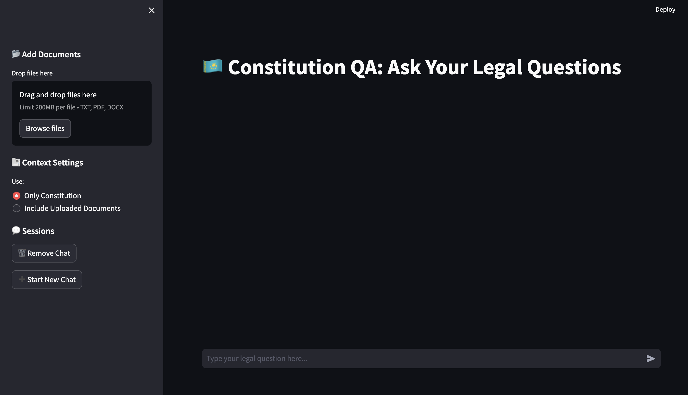
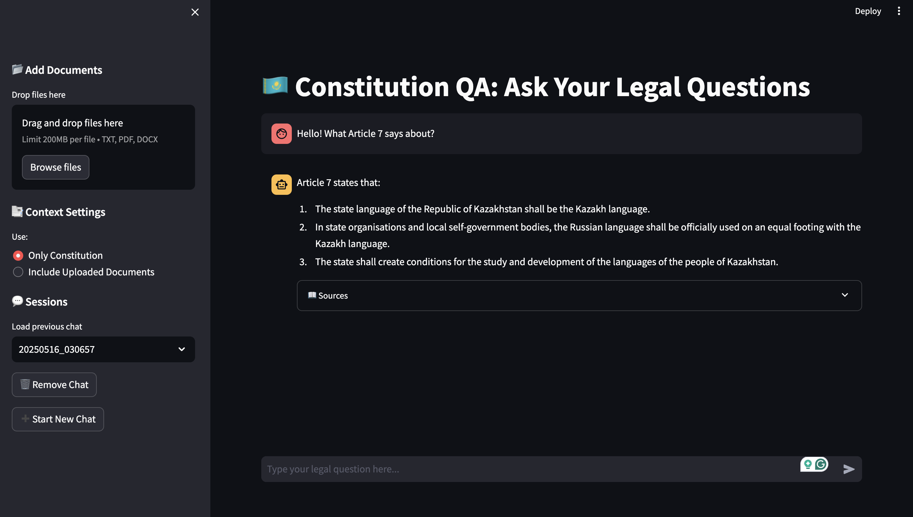
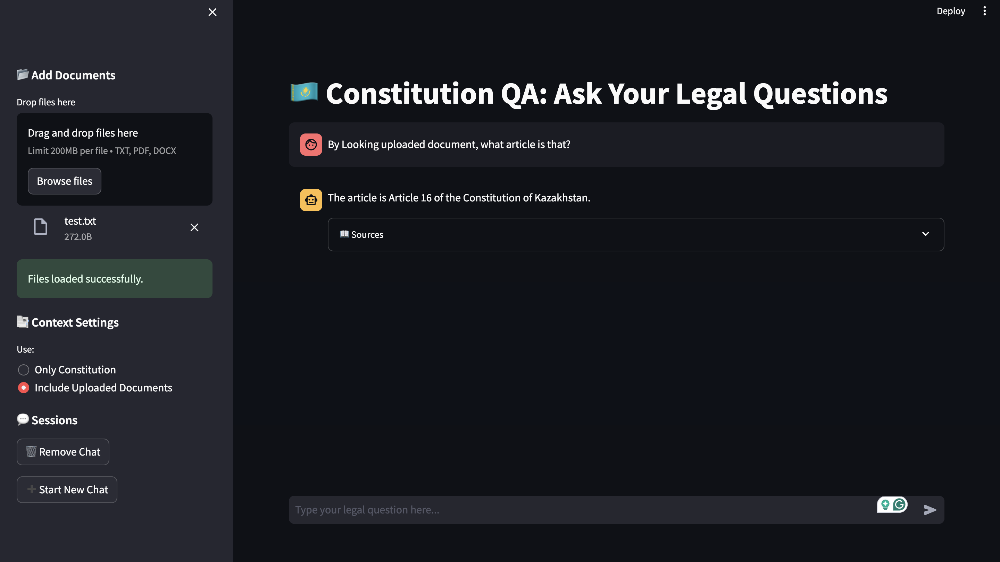

# 🇰🇿 Constitution QA Assistant

This project is an AI-powered Legal Assistant focused on the Constitution of the Republic of Kazakhstan. Built with Streamlit, LangChain, Ollama, and ChromaDB, it enables users to ask legal questions and receive contextual answers based on constitutional text, with optional user-uploaded legal documents.

# 📄 Features
* ✉️ Chatbot Interface to ask legal questions

* 🔍 Context-aware QA from the Constitution of Kazakhstan

* 📂 Optional Document Uploads (.txt, .pdf, .docx)

* 📃 Multi-session Chat History with persistence

* 📖 Source-based Responses including article citations

* 🔎 Web scraper to fetch the latest constitution from official website

# 📃 Demo Screenshots

### Main Page


### Constitutional Answer


### Uploaded Document Answer



# 🚀 Getting Started

1. Clone the repo:
   ```bash
   git clone https://github.com/xwvwww/Assignment-3-Blockchain.git
   cd AIConstitutional_KZ
   ```
2. Install dependencies (Make sure you have Ollama installed and running locally) :
   ```bash
   pip install -r requirements.txt
   ```
3. Run the Streamlit app
   ```bash
   streamlit run src/main.py
   ```

## License

This project is licensed under the MIT License - see the LICENSE file for details.


